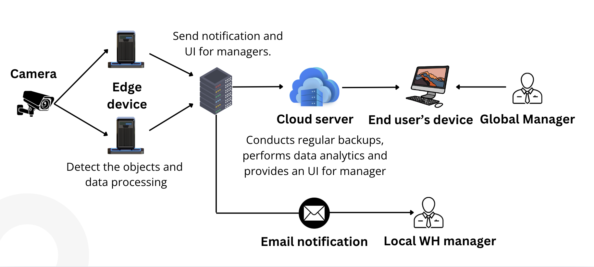
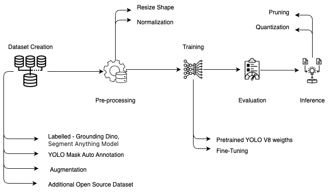

# Max Box Layers on Pallets 

## Overview

The EHS AI-Based Pallet Stacking and Transportation System is an advanced solution that enhances safety and efficiency in logistics and production environments.

This system utilizes cutting-edge artificial intelligence (AI) and machine learning (ML) technologies to ensure that pallets are stacked with a maximum of five layers of boxes, preventing overloading and ensuring safe transportation from the warehouse to the production area.

## Objective

Enhance Safety: Prevent the overloading of pallets to reduce the risk of accidents and injuries during transportation.

Compliance: Ensure adherence to safety regulations and pallet stacking and transportation standards.

## Key Components

### Data Collection and Annotation

Collect a comprehensive dataset of images and videos from warehouse environments. 

Annotate the dataset to label various objects such as boxes and pallets.

### Architectural Overview

### Machine Learning Pipeline

